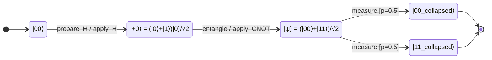

# Q-Orca — Quantum Orchestrated State Machine Language

Q-Orca is a quantum-aware dialect of [Orca](https://github.com/orca-lang/orca-lang), a state machine language written in Markdown. It extends Orca with Dirac ket notation for quantum states, unitary gate actions, entanglement verification, and simulation via Qiskit.

---

## Setup

```bash
# Create and activate a virtual environment
python3 -m venv .venv
source .venv/bin/activate  # Linux/macOS
# .venv\Scripts\activate   # Windows

# Install Q-Orca in editable mode (with quantum libraries)
pip install -e ".[quantum]"

# Or install with MCP server support
pip install -e ".[all]"

# Or install without quantum deps first
pip install -e .
pip install qiskit
pip install qutip  # optional, for quantum verification
```

To exit the virtual environment: `deactivate`

---

## Running

```bash
# Verify a quantum machine
q-orca verify examples/bell-entangler.q.orca.md
q-orca verify examples/bell-entangler.q.orca.md --json

# Compile to Mermaid diagram
q-orca compile mermaid examples/quantum-teleportation.q.orca.md

# Compile to OpenQASM 3.0
q-orca compile qasm examples/bell-entangler.q.orca.md

# Generate Qiskit simulation script
q-orca simulate examples/bell-entangler.q.orca.md

# Run simulation immediately
q-orca simulate examples/bell-entangler.q.orca.md --run

# Noisy simulation with 2048 shots
q-orca simulate examples/bell-entangler.q.orca.md --run --shots 2048

# With QuTiP verification
q-orca simulate examples/bell-entangler.q.orca.md --run --verbose

# MCP self-description (for Claude Code integration)
q-orca --tools --json

# Read source from stdin
cat examples/bell-entangler.q.orca.md | q-orca --stdin verify
```

---

## Commands

### `q-orca verify`

Parses and verifies a quantum machine definition. Runs 5 verification stages:

1. **Structural** — reachability, deadlocks, orphan states
2. **Completeness** — (state, event) coverage
3. **Determinism** — guard mutual exclusion
4. **Quantum** — unitarity, no-cloning, entanglement, collapse completeness
5. **Superposition leak** — static analysis of superposition coherence

Options:
- `--json` — output as JSON
- `--skip-completeness` — skip event completeness checks
- `--skip-quantum` — skip quantum-specific checks

### `q-orca compile`

Compiles a machine to a target format.

```bash
q-orca compile mermaid examples/quantum-teleportation.q.orca.md
q-orca compile qasm examples/bell-entangler.q.orca.md
```

### `q-orca simulate`

Generates and optionally runs a Qiskit Python script.

```bash
# Output the Qiskit script (no execution)
q-orca simulate examples/bell-entangler.q.orca.md

# Run the simulation immediately
q-orca simulate examples/bell-entangler.q.orca.md --run

# Noisy simulation with 2048 shots
q-orca simulate examples/bell-entangler.q.orca.md --run --shots 2048

# Skip QuTiP verification
q-orca simulate examples/bell-entangler.q.orca.md --run --skip-qutip

# JSON output
q-orca simulate examples/bell-entangler.q.orca.md --run --json
```

---

## Examples

| File | Description |
|------|-------------|
| `bell-entangler.q.orca.md` | Bell state via Hadamard + CNOT |
| `quantum-teleportation.q.orca.md` | Teleports a qubit via Bell pair |
| `deutsch-jozsa.q.orca.md` | Constant vs balanced oracle detection |
| `ghz-state.q.orca.md` | 3-qubit GHZ state preparation |

---

## Machine Format



### Source

```markdown
# machine BellEntangler

## context
| Field   | Type        | Default |
|---------|-------------|---------|
| qubits  | list<qubit> |         |

## events
- prepare_H
- entangle
- measure_done

## state |00> [initial]
> Ground state

## state |+0> = (|0> + |1>)|0>/√2
> After Hadamard — superposition

## state |ψ> = (|00> + |11>)/√2
> Bell state

## state |00_collapsed> [final]
> Measured |00>

## state |11_collapsed> [final]
> Measured |11>

## transitions
| Source | Event        | Guard                   | Target         | Action              |
|--------|--------------|-------------------------|----------------|---------------------|
| |00>   | prepare_H    |                         | |+0>           | apply_H_on_q0      |
| |+0>   | entangle     |                         | |ψ>            | apply_CNOT_q0_to_q1 |
| |ψ>    | measure_done | prob_collapse('00')=0.5 | |00_collapsed> | set_outcome_0       |
| |ψ>    | measure_done | prob_collapse('11')=0.5 | |11_collapsed> | set_outcome_1       |

## guards
| Name                | Expression                     |
|---------------------|--------------------------------|
| prob_collapse('00') | fidelity(|ψ>, |00>) ** 2 ≈ 0.5 |
| prob_collapse('11') | fidelity(|ψ>, |11>) ** 2 ≈ 0.5 |

## actions
| Name                | Signature    | Effect             |
|---------------------|--------------|--------------------|
| apply_H_on_q0       | (qs) -> qs   | Hadamard(qs[0])    |
| apply_CNOT_q0_to_q1 | (qs) -> qs   | CNOT(qs[0], qs[1]) |
| set_outcome_0       | (ctx) -> ctx | ctx.outcome = 0    |
| set_outcome_1       | (ctx) -> ctx | ctx.outcome = 1    |

## verification rules
- unitarity: all gates preserve norm
- entanglement: Bell state has Schmidt rank > 1
- completeness: all collapse branches covered
- no-cloning: no copy operations
```

---

## MCP Server

Q-Orca includes an MCP (Model Context Protocol) server that exposes all skills as tools for AI clients like Claude Code.

### Setup

```bash
# Install with MCP dependencies
pip install -e ".[mcp]"

# Or install with all dependencies (quantum + MCP)
pip install -e ".[all]"
```

### Running the MCP Server

```bash
# Start the MCP server (uses stdio transport)
q-orca-mcp

# Or via Python module
python -m q_orca.mcp_server
```

### Claude Code Configuration

Add to your Claude Code settings (`~/.claude/settings.json` or project `.claude.json`):

```json
{
  "mcpServers": {
    "q-orca": {
      "command": "q-orca-mcp",
      "cwd": "/path/to/your/project"
    }
  }
}
```

### Available MCP Tools

| Tool | Description |
|------|-------------|
| `parse_machine` | Parse a Q-Orca machine and return structure as JSON |
| `verify_machine` | Run 5-stage verification pipeline |
| `compile_machine` | Compile to Mermaid, QASM, or Qiskit |
| `generate_machine` | Generate quantum machine from natural language spec |
| `refine_machine` | Fix verification errors using LLM |
| `simulate_machine` | Run Qiskit simulation |
| `server_status` | Get server version and LLM config |

### LLM Provider Configuration

The MCP server uses environment variables for LLM configuration:

```bash
# Required for generation/refinement
export ANTHROPIC_API_KEY=sk-ant-...

# Or via ORCA_ prefix (overrides ANTHROPIC_API_KEY)
export ORCA_API_KEY=sk-ant-...

# Optional overrides
export ORCA_PROVIDER=anthropic   # anthropic, openai, ollama, grok
export ORCA_MODEL=claude-sonnet-4-6
export ORCA_BASE_URL=           # For proxies or API-compatible endpoints
export ORCA_MAX_TOKENS=4096
export ORCA_TEMPERATURE=0.7
```

Or via a YAML config file (`orca.yaml` or `.orca.yaml` in your project):

```yaml
provider: anthropic
model: claude-sonnet-4-6
api_key: sk-ant-...
max_tokens: 4096
temperature: 0.7
```

---

## Architecture

```
q_orca/
├── __init__.py            # Package exports
├── ast.py                 # AST dataclasses
├── cli.py                 # CLI entrypoint
├── skills.py              # Skill functions (parse, verify, compile, generate, refine)
├── tools.py               # MCP tool JSON schemas
├── mcp_server.py          # MCP server (stdio JSON-RPC)
├── parser/
│   └── markdown_parser.py # Two-phase markdown parser
├── verifier/
│   ├── types.py           # Verification result types
│   ├── structural.py      # Reachability, deadlocks, orphans
│   ├── completeness.py    # (state, event) coverage
│   ├── determinism.py     # Guard mutual exclusion
│   ├── quantum.py         # Unitarity, no-cloning, entanglement
│   └── superposition.py   # Superposition coherence leak
├── compiler/
│   ├── mermaid.py         # Mermaid state diagram
│   ├── qasm.py            # OpenQASM 3.0
│   └── qiskit.py          # Qiskit Python script
├── llm/
│   ├── provider.py        # Abstract LLM provider interface
│   ├── anthropic.py       # Anthropic provider
│   ├── openai.py          # OpenAI provider
│   ├── ollama.py          # Ollama provider
│   └── grok.py            # Grok provider
├── config/
│   ├── loader.py          # YAML/env config loader
│   └── types.py           # Config types
└── runtime/
    ├── types.py           # Simulation result types
    └── python.py          # Python subprocess runner + simulation
```
