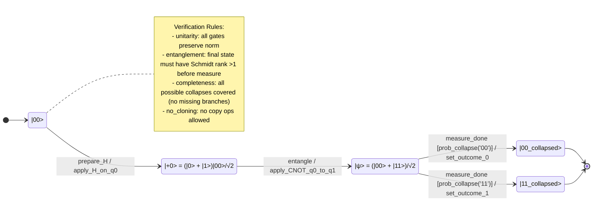

# Q-Orca — Quantum Orchestrated State Machine Language

[](https://github.com/jascal/q-orca-lang/actions/workflows/test.yml)
[](https://github.com/jascal/q-orca-lang/actions/workflows/verify-examples.yml)
[](https://pypi.org/project/q-orca/)
[](https://pypi.org/project/q-orca/)

Q-Orca is a quantum-aware dialect of [Orca](https://github.com/orca-lang/orca-lang), a state machine language written in Markdown. It extends Orca with Dirac ket notation for quantum states, unitary gate actions, entanglement verification, and simulation via Qiskit.

All 5 example machines (Bell, GHZ, Deutsch-Jozsa, Teleportation, VQE) pass the full 5-stage verification pipeline on every commit, across Python 3.10–3.13.

---

## Install

```bash
pip install q-orca[quantum]
```

Installs the CLI, verifier, compilers, and Qiskit/QuTiP simulation support.

```bash
pip install q-orca[all]      # + MCP server (pyyaml)
pip install q-orca           # CLI + verifier only, no quantum libs
```

---

## Setup (development)

```bash
# Create and activate a virtual environment
python3 -m venv .venv
source .venv/bin/activate  # Linux/macOS
# .venv\Scripts\activate   # Windows

# Install Q-Orca in editable mode (with quantum libraries)
pip install -e ".[quantum]"

# Or install with MCP server support
pip install -e ".[all]"

# Or install without quantum deps first
pip install -e .
pip install qiskit
pip install qutip  # optional, for quantum verification
```

To exit the virtual environment: `deactivate`

---

## Running

```bash
# Verify a quantum machine
q-orca verify examples/bell-entangler.q.orca.md
q-orca verify examples/bell-entangler.q.orca.md --json

# Compile to Mermaid diagram
q-orca compile mermaid examples/quantum-teleportation.q.orca.md

# Compile to OpenQASM 3.0
q-orca compile qasm examples/bell-entangler.q.orca.md

# Generate Qiskit simulation script
q-orca simulate examples/bell-entangler.q.orca.md

# Run simulation immediately
q-orca simulate examples/bell-entangler.q.orca.md --run

# Noisy simulation with 2048 shots
q-orca simulate examples/bell-entangler.q.orca.md --run --shots 2048

# With QuTiP verification
q-orca simulate examples/bell-entangler.q.orca.md --run --verbose

# MCP self-description (for Claude Code integration)
q-orca --tools --json

# Read source from stdin
cat examples/bell-entangler.q.orca.md | q-orca --stdin verify
```

---

## How Verification Works

Every machine passes through 5 stages in order. A failure in stage 1 stops the pipeline early; later stages are cumulative.

| Stage | Module | What it checks |
|-------|--------|----------------|
| 1 — Structural | `structural.py` | All states reachable, no deadlocks, no orphan states |
| 2 — Completeness | `completeness.py` | Every (state, event) pair has at least one outgoing transition |
| 3 — Determinism | `determinism.py` | Guards on competing transitions are mutually exclusive |
| 4 — Quantum | `quantum.py` | Unitarity of gates, no-cloning violations, entanglement declarations, collapse probability sum = 1 |
| 4b — Dynamic | `dynamic.py` | QuTiP circuit simulation: actual Schmidt rank and Von Neumann entropy for every declared entangled state |
| 5 — Superposition | `superposition.py` | No superposition coherence leaks across unguarded transitions |

Stage 4b is a soft dependency: if QuTiP is not installed it skips gracefully and CI still passes.

### Stage 4 vs 4b — static vs dynamic

Stage 4 (`quantum.py`) checks your **declarations**: does the Markdown say this state is entangled? Does a CNOT gate lead to it? These are fast structural checks that catch obvious mistakes.

Stage 4b (`dynamic.py`) **simulates the circuit**: it replays every gate in the path from the initial state, then computes the actual Von Neumann entropy and Schmidt rank of the resulting state vector using QuTiP. This catches cases where the gate sequence is present but wrong — e.g. two Hadamards that cancel, a CNOT on the wrong qubits, or a rotation angle that leaves the state separable.

For a valid Bell state (`H(q0)` then `CNOT(q0, q1)`), the dynamic verifier internally computes:

```json
{
  "state": "|ψ>",
  "entropy_checks": { "q0": 1.0 },
  "schmidt_ranks": { "q0-q1": 2 },
  "passed": true,
  "details": {}
}
```

- **`entropy_checks.q0 = 1.0`** — Von Neumann entropy of qubit 0 after tracing out q1. Exactly 1.0 = maximally entangled.
- **`schmidt_ranks.q0-q1 = 2`** — Schmidt rank across the q0/q1 bipartition. Rank > 1 confirms entanglement; rank = 1 means separable.

If either value falls below threshold, stage 4b emits a `DYNAMIC_NO_ENTANGLEMENT` error (shown below).

### Example failure report

A machine with a missing CNOT gate and an incomplete collapse:

```
$ q-orca verify broken-bell.q.orca.md

  Machine: BrokenBell
  States: |00>, |ψ>, |00_collapsed>
  Events: prepare, measure_done
  Transitions: 2
  Verification rules: unitarity, entanglement

  Result: INVALID
  [WARN] ENTANGLEMENT_WITHOUT_GATE: State '|ψ>' is declared as entangled but no entangling gate (CNOT, CZ, etc.) leads to it
        -> Add a transition with a CNOT or other entangling gate action
  [ERR]  DYNAMIC_NO_ENTANGLEMENT: State '|ψ>' should be entangled but verification failed: q0-q1: Schmidt rank 1 ≤ 1
        -> Ensure the circuit creates an entangled state with CNOT or CZ gates
  [ERR]  DYNAMIC_INCOMPLETE_COLLAPSE: Measurement branches have probabilities summing to 0.5000, expected 1.0
        -> Ensure all collapse outcomes are covered with probabilities summing to 1
```

Same report as JSON (`--json`):

```json
{
  "machine": "BrokenBell",
  "valid": false,
  "errors": [
    {
      "code": "ENTANGLEMENT_WITHOUT_GATE",
      "message": "State '|ψ>' is declared as entangled but no entangling gate (CNOT, CZ, etc.) leads to it",
      "severity": "warning",
      "suggestion": "Add a transition with a CNOT or other entangling gate action"
    },
    {
      "code": "DYNAMIC_NO_ENTANGLEMENT",
      "message": "State '|ψ>' should be entangled but verification failed: q0-q1: Schmidt rank 1 ≤ 1",
      "severity": "error",
      "suggestion": "Ensure the circuit creates an entangled state with CNOT or CZ gates"
    },
    {
      "code": "DYNAMIC_INCOMPLETE_COLLAPSE",
      "message": "Measurement branches have probabilities summing to 0.5000, expected 1.0",
      "severity": "error",
      "suggestion": "Ensure all collapse outcomes are covered with probabilities summing to 1"
    }
  ]
}
```

### Declaring invariants in Markdown

For precise dynamic checks, add an `## invariants` section to your machine. This tells stage 4b exactly which qubit pairs to verify rather than using the default adjacent-pair heuristic:

```markdown
## invariants
- entanglement(q0,q1) = True
- schmidt_rank(q0,q1) >= 2
```

---

## Commands

### `q-orca verify`

Parses and verifies a quantum machine definition through all 5 stages.

```bash
q-orca verify examples/bell-entangler.q.orca.md
q-orca verify examples/bell-entangler.q.orca.md --json
q-orca verify examples/bell-entangler.q.orca.md --strict   # warnings → errors
```

Options:
- `--json` — output as JSON
- `--strict` — treat warnings as errors
- `--skip-completeness` — skip event completeness checks
- `--skip-quantum` — skip quantum-specific checks

### `q-orca compile`

Compiles a machine to a target format.

```bash
q-orca compile mermaid examples/quantum-teleportation.q.orca.md
q-orca compile qasm examples/bell-entangler.q.orca.md
```

### `q-orca simulate`

Generates and optionally runs a Qiskit Python script.

```bash
# Output the Qiskit script (no execution)
q-orca simulate examples/bell-entangler.q.orca.md

# Run the simulation immediately
q-orca simulate examples/bell-entangler.q.orca.md --run

# Noisy simulation with 2048 shots
q-orca simulate examples/bell-entangler.q.orca.md --run --shots 2048

# Skip QuTiP verification
q-orca simulate examples/bell-entangler.q.orca.md --run --skip-qutip

# JSON output
q-orca simulate examples/bell-entangler.q.orca.md --run --json
```

---

## Examples

| File | Description |
|------|-------------|
| `bell-entangler.q.orca.md` | Bell state via Hadamard + CNOT |
| `quantum-teleportation.q.orca.md` | Teleports a qubit via Bell pair |
| `deutsch-jozsa.q.orca.md` | Constant vs balanced oracle detection |
| `ghz-state.q.orca.md` | 3-qubit GHZ state preparation |
| `vqe-heisenberg.q.orca.md` | Variational quantum eigensolver for Heisenberg XXX Hamiltonian |

---

## Machine Format

The full source for every example is in [`examples/`](examples/). Here is `bell-entangler.q.orca.md`:

```markdown
# machine BellEntangler

## context
| Field      | Type          | Default          |
|------------|---------------|------------------|
| qubits     | list<qubit>   | [q0, q1]         |
| outcome    | int           | -1               |

## events
- prepare_H
- entangle
- measure_done

## state |00>
> Ground state, no entanglement yet

## state |+0> = (|0> + |1>)|00>/√2
> After Hadamard on qubit 0 — superposition

## state |ψ> = (|00> + |11>)/√2
> Bell state after Hadamard + CNOT

## state |00_collapsed> [final]
> Collapsed to |00> after measurement

## state |11_collapsed> [final]
> Collapsed to |11> after measurement

## transitions
| Source          | Event        | Guard                  | Target              | Action                  |
|-----------------|--------------|------------------------|---------------------|-------------------------|
| |00>            | prepare_H    |                        | |+0>                | apply_H_on_q0           |
| |+0>            | entangle     |                        | |ψ>                 | apply_CNOT_q0_to_q1     |
| |ψ>             | measure_done | prob_collapse('00')=0.5| |00_collapsed>       | set_outcome_0           |
| |ψ>             | measure_done | prob_collapse('11')=0.5| |11_collapsed>       | set_outcome_1           |

## guards
| Name                | Expression                          |
|---------------------|-------------------------------------|
| prob_collapse('00') | fidelity(|ψ>, |00>) ** 2 ≈ 0.5     |
| prob_collapse('11') | fidelity(|ψ>, |11>) ** 2 ≈ 0.5     |

## actions
| Name                | Signature                          | Effect                     |
|---------------------|------------------------------------|----------------------------|
| apply_H_on_q0       | (qs) -> qs                         | Hadamard(qs[0])            |
| apply_CNOT_q0_to_q1 | (qs) -> qs                         | CNOT(qs[0], qs[1])         |
| set_outcome_0       | (ctx, val) -> Context              | ctx.outcome = 0            |
| set_outcome_1       | (ctx, val) -> Context              | ctx.outcome = 1            |

## effects
| Name          | Input                  | Output            |
|---------------|------------------------|-------------------|
| collapse      | state vector           | classical bit     |

## verification rules
- unitarity: all gates preserve norm
- entanglement: final state must have Schmidt rank >1 before measure
- completeness: all possible collapses covered (no missing branches)
- no-cloning: no copy ops allowed
```

> **Full source:** [`examples/bell-entangler.q.orca.md`](examples/bell-entangler.q.orca.md) — or view all examples in [`examples/`](examples/)

---

### Verify output (5-stage pipeline)

```bash
$ q-orca verify examples/bell-entangler.q.orca.md --json
```
```json
{
  "machine": "BellEntangler",
  "valid": true,
  "errors": []
}
```

All 5 stages pass silently. To see individual stage results, use the Python API:

```python
from q_orca.skills import verify_skill

result = verify_skill({"file": "examples/bell-entangler.q.orca.md"})
# result = {
#   "status": "valid",    ← all 5 stages passed
#   "machine": "BellEntangler",
#   "states": 5,
#   "events": 3,
#   "transitions": 4,
#   "errors": []
# }
```

The 5 verification stages are:

| Stage | Module | Checks |
|-------|--------|--------|
| 1 Structural | `structural.py` | Reachability, deadlocks, orphan states |
| 2 Completeness | `completeness.py` | Every (state, event) pair has a transition |
| 3 Determinism | `determinism.py` | Guards are mutually exclusive |
| 4 Quantum | `quantum.py` + `dynamic.py` | Unitarity, no-cloning, entanglement (QuTiP), collapse completeness |
| 5 Superposition | `superposition.py` | No superposition coherence leaks |

---

### Compile to Mermaid diagram

```bash
$ q-orca compile mermaid examples/bell-entangler.q.orca.md
```


---

### Compile to OpenQASM 3.0

```bash
$ q-orca compile qasm examples/bell-entangler.q.orca.md
```
```qasm
// Generated by Q-Orca compiler
// Machine: BellEntangler
OPENQASM 3.0;
include "stdgates.inc";

qubit[2] q;
bit[2] c;

int outcome = -1;

// Gate sequence derived from state machine transitions
// |00> -> |+0> via prepare_H
h q[0];
// |+0> -> |ψ> via entangle
cx q[0], q[1];
// |ψ> -> |00_collapsed> via measure_done
// |ψ> -> |11_collapsed> via measure_done

// Measurement
c[0] = measure q[0];
c[1] = measure q[1];
```

---

### Simulate with Qiskit

**Analytic (statevector) — fidelity + entanglement verification:**

```bash
$ q-orca simulate examples/bell-entangler.q.orca.md --run
```
```
  Machine: BellEntangler
  Success: True
  Probabilities:
    00: 50.00%
    01: 0.00%
    10: 0.00%
    11: 50.00%
  QuTiP Verification:
    Unitarity: VERIFIED
    Entanglement: VERIFIED
    Schmidt Rank: 2
```

**Probabilistic (shots) — observed counts:**

```bash
$ q-orca simulate examples/bell-entangler.q.orca.md --run --shots 512
```
```
  Machine: BellEntangler
  Success: True
  Counts: {'11': 269, '00': 243}
```

**JSON output** (useful for tooling):

```bash
$ q-orca simulate examples/bell-entangler.q.orca.md --run --json
```
```json
{
  "machine": "BellEntangler",
  "success": true,
  "probabilities": {
    "00": 0.5,
    "01": 0.0,
    "10": 0.0,
    "11": 0.5
  },
  "counts": null,
  "qutipVerification": {
    "unitarityVerified": true,
    "entanglementVerified": true,
    "schmidtRank": 2,
    "errors": []
  }
}
```

---

### Generated Qiskit script snippet

```python
# Generated by Q-Orca compiler
# Machine: BellEntangler

from qiskit import QuantumCircuit
from qiskit.quantum_info import Statevector, Operator
from qiskit.providers.basic_provider import BasicSimulator

qubit_count = 2
qc = QuantumCircuit(2)

# Gate sequence from state machine
qc.h(0)        # |00> --prepare_H--> |+0>
qc.cx(0, 1)    # |+0> --entangle--> |ψ>

# Simulation (analytic)
sv = Statevector(qc)
probs = sv.probabilities()
# ...

# QuTiP Verification
unitary_matrix = Operator(qc).data.tolist()
U = np.array(unitary_matrix)
# Unitarity: U U† ≈ I
# Entanglement: Schmidt rank across Bell partition
```

---

## MCP Server

Q-Orca includes an MCP (Model Context Protocol) server that exposes all skills as tools for AI clients like Claude Code.

### Setup

```bash
# Install with MCP dependencies
pip install -e ".[mcp]"

# Or install with all dependencies (quantum + MCP)
pip install -e ".[all]"
```

### Running the MCP Server

```bash
# Start the MCP server (uses stdio transport)
q-orca-mcp

# Or via Python module
python -m q_orca.mcp_server
```

### Claude Code Configuration

Add to your Claude Code settings (`~/.claude/settings.json` or project `.claude.json`):

```json
{
  "mcpServers": {
    "q-orca": {
      "command": "q-orca-mcp",
      "cwd": "/path/to/your/project"
    }
  }
}
```

### Available MCP Tools

| Tool | Description |
|------|-------------|
| `parse_machine` | Parse a Q-Orca machine and return structure as JSON |
| `verify_machine` | Run 5-stage verification pipeline |
| `compile_machine` | Compile to Mermaid, QASM, or Qiskit |
| `generate_machine` | Generate quantum machine from natural language spec |
| `refine_machine` | Fix verification errors using LLM |
| `simulate_machine` | Run Qiskit simulation |
| `server_status` | Get server version and LLM config |

### LLM Provider Configuration

`ORCA_API_KEY` is the universal key — it works for any provider:

```bash
# Universal API key (works for any provider)
export ORCA_API_KEY=your-api-key

# Optional overrides
export ORCA_PROVIDER=anthropic   # anthropic, openai, minimax, ollama, grok
export ORCA_MODEL=claude-sonnet-4-6
export ORCA_MAX_TOKENS=4096
export ORCA_TEMPERATURE=0.7
```

Or via a YAML config file (`orca.yaml` or `.orca.yaml` in your project):

```yaml
# Anthropic (default)
provider: anthropic
model: claude-sonnet-4-6
api_key: ${ORCA_API_KEY}
```

```yaml
# MiniMax
provider: minimax
model: MiniMax-M2.7
api_key: ${ORCA_API_KEY}
```

Provider-specific keys (`ANTHROPIC_API_KEY`, `MINIMAX_API_KEY`, `OPENAI_API_KEY`) are also supported as fallbacks.

---

## Architecture

```mermaid
flowchart TD
    subgraph Input
        MD[".q.orca.md file"]
        NL[Natural Language]
    end

    MD --> Parser

    subgraph Parser
        MP[markdown_parser.py<br/>Two-phase parse]
    end

    Parser --> AST[AST: QMachineDef]

    subgraph "Verifier (5 stages)"
        V1[structural.py<br/>Reachability, deadlocks, orphans]
        V2[completeness.py<br/>(state, event) coverage]
        V3[determinism.py<br/>Guard mutual exclusion]
        V4[quantum.py<br/>Unitarity, no-cloning, entanglement]
        V4D[dynamic.py<br/>QuTiP: Schmidt rank, entropy]
        V5[superposition.py<br/>Superposition coherence leak]
        V1 --> V2 --> V3 --> V4 --> V4D --> V5
    end

    AST --> Verifier
    Verifier --> VResult{Valid?}

    VResult -->|Yes| Compiler
    VResult -->|No| Refine[refine_skill<br/>LLM fix loop]

    Refine -->|Fixed source| Parser
    NL --> Generate[generate_skill<br/>LLM generation]
    Generate -->|Raw .q.orca.md| Parser

    subgraph Compiler
        CM[Mermaid]
        CQ[QASM 3.0]
        CK[Qiskit script]
    end

    Compiler --> MermaidDiagram[Rendered state diagram]
    Compiler --> QASMCode[Quantum circuit code]
    Compiler --> QiskitScript[Python simulation]

    QiskitScript --> Runtime[Python runtime]
    Runtime --> SimResult[Counts, Probabilities, Fidelity]

    style Verifier fill:#1b4f72,color:#fff
    style Compiler fill:#27ae60,color:#fff
    style Runtime fill:#8e44ad,color:#fff
    style NL fill:#f39c12,color:#fff
```

### Directory structure

```
q_orca/
├── __init__.py            # Package exports
├── ast.py                 # AST dataclasses
├── cli.py                 # CLI entrypoint
├── skills.py              # Skill functions (parse, verify, compile, generate, refine)
├── tools.py               # MCP tool JSON schemas
├── mcp_server.py          # MCP server (stdio JSON-RPC)
├── parser/
│   └── markdown_parser.py # Two-phase markdown parser
├── verifier/
│   ├── types.py           # Verification result types
│   ├── structural.py      # Reachability, deadlocks, orphans
│   ├── completeness.py    # (state, event) coverage
│   ├── determinism.py     # Guard mutual exclusion
│   ├── quantum.py         # Unitarity, no-cloning, entanglement
│   ├── superposition.py   # Superposition coherence leak
│   └── dynamic.py         # QuTiP circuit simulation
├── compiler/
│   ├── mermaid.py         # Mermaid state diagram
│   ├── qasm.py            # OpenQASM 3.0
│   └── qiskit.py          # Qiskit Python script
├── llm/
│   ├── provider.py        # Abstract LLM provider interface
│   ├── anthropic.py       # Anthropic provider
│   ├── openai.py          # OpenAI provider
│   ├── minimax.py         # MiniMax provider
│   ├── ollama.py          # Ollama provider
│   └── grok.py            # Grok provider
├── config/
│   ├── loader.py          # YAML/env config loader
│   └── types.py           # Config types
└── runtime/
    ├── types.py           # Simulation result types
    └── python.py          # Python subprocess runner + simulation
```
