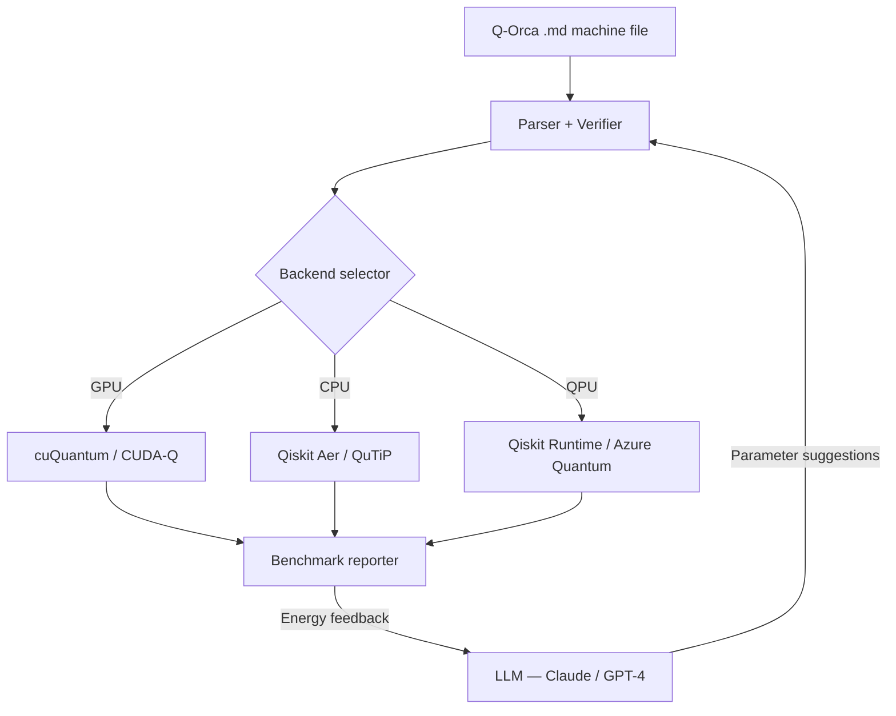

# Compute Needs — Q-Orca

**Project:** Q-Orca — Quantum Orchestrated State Machine Language  
**Repo:** https://github.com/jascal/q-orca-lang  
**Contact:** j.allan.scott@gmail.com

---

## What Q-Orca is

Q-Orca is an open-source quantum state machine language that lets developers
define, verify, and simulate quantum programs as first-class state machines —
with the same rigour applied to production distributed systems.

A Q-Orca program looks like this:

```markdown
# machine QAOAMaxCut

## state |000> [initial]
## state |+++ >
## state |cost_applied>
## state |measured> [final]

## transitions
| Source         | Event      | Target         | Action         |
|----------------|------------|----------------|----------------|
| |000>          | init       | |+++ >         | hadamard_layer |
| |+++ >         | apply_cost | |cost_applied>  | cost_unitary   |
| |cost_applied> | apply_mixer| |mixed>         | mixer_unitary  |
| |mixed>        | readout    | |measured>      |                |
```

The toolchain compiles this into Qiskit or CUDA-Q circuits, runs a 5-stage
verification pipeline (unitarity, entanglement, coherence, collapse
completeness, resource bounds), and provides simulation results — all through
a plain CLI or an MCP server that LLMs can drive directly.

---

## Why we need GPU compute

### 1. Statevector simulation scales exponentially with qubit count

A statevector for $n$ qubits requires $2^n$ complex amplitudes.  At 20 qubits
that is $2^{20}\approx$ 1 million complex doubles, or ~16 MB per state; at
24 qubits it grows to ~16 million amplitudes (~256 MB), and at 30 qubits to
~1 billion amplitudes (~16 GB).
Running QAOA or VQE optimization loops (hundreds of circuit evaluations per
shot) quickly becomes infeasible on CPU-only hardware:

| Qubits | Statevector size | Typical CPU sim time (per eval) |
|--------|------------------|---------------------------------|
| 12     | 8 K amplitudes   | ~50 ms                          |
| 16     | 64 K amplitudes  | ~1 s                            |
| 20     | 1 M amplitudes   | ~20–40 s                        |
| 24     | 16 M amplitudes  | ~8–15 min (impractical in loop) |

GPU-accelerated statevector simulation (via cuQuantum / cuStateVec) typically
provides **10–100× speedup** at 16–24 qubits, making optimization loops that
take hours on CPU feasible in minutes.

### 2. LLM-driven circuit evolution is doubly GPU-hungry

Q-Orca's flagship research direction pairs an LLM (Claude Haiku or GPT-4o) with
the quantum simulator in a closed feedback loop:

```
LLM suggests parameter changes (γ, β, depth)
          ↓
Q-Orca compiles to circuit
          ↓
GPU evaluates expectation value (statevector sim)
          ↓
Energy improvement accepted or rejected
          ↓
LLM uses result to refine next suggestion
```

Each "round" of this loop requires one LLM inference call and one GPU
simulation. A serious optimization campaign (1,000 rounds at 20 qubits)
currently takes prohibitively long on CPU. GPU acceleration unlocks research
at scale.

### 3. The Dirac rewriter needs symbolic verification at scale

An in-development component — the Dirac notation symbolic rewriter — uses
equality saturation (the `egg` framework) to verify quantum circuit equivalences.
Larger circuits (20+ qubits, multi-layer ansätze) generate equality graphs with
millions of nodes; GPU-parallel evaluation of candidate rewrites is the natural
next step once the CPU prototype is validated.

---

## Requested resources

### NVIDIA — H100 GPU hours

| Workload                              | Estimated H100-hours |
|---------------------------------------|----------------------|
| QAOA/VQE scaling sweeps (3–24 qubits) | 200                  |
| LLM evolution campaigns (1K rounds×20q) | 5,000              |
| Dirac rewriter verification sweeps    | 2,000                |
| Ablation studies + safety headroom    | 1,440                |
| **Total (base request)**              | **~8,640**           |
| **Total (full 30K allocation)**       | **30,000**           |

The full 30,000-hour allocation would additionally enable:
- Qubit counts up to 30+ (2× beyond current feasibility)
- QAOA depth ≥ 3 (more realistic for NISQ advantage)
- Parallel hyperparameter sweeps across 10+ random graph instances
- Reproducible artefacts for multiple conference submissions

### IBM Quantum — QPU hours

Q-Orca compiles to OpenQASM 2.0 and integrates with Qiskit Runtime. QPU access
would enable:
- Noise-aware transpilation and error mitigation validation
- Real-hardware benchmarks comparing ideal simulation vs noisy QPU execution
- Validation of the formal verification pipeline against physical noise models

**Requested:** 5–10 QPU hours on Eagle (127-qubit) or Heron (156-qubit) systems.

### Microsoft Azure Quantum — Cloud credits

Azure credits would fund:
- IonQ / Quantinuum QPU access for trapped-ion noise model validation
- Azure Quantum Development Kit integration (Q# bridge)
- CI/CD cloud costs for automated benchmark pipelines

**Requested:** $5,000–$10,000 Azure credits.

---

## Architecture



---

## Current status

- All 15 example machines pass the full 5-stage verification pipeline on every
  commit (Python 3.10–3.13, CI via GitHub Actions)
- CUDA-Q backend: wired for single-qubit examples; GPU-parallel statevector in
  progress (blocked on hardware access)
- Benchmark scaffolding complete: `benchmarks/` directory with QAOA and VQE
  scaling sweeps ready to run on GPU hardware
- CPU baseline numbers: pending (run `python benchmarks/gpu_vs_cpu.py --backend cpu`)
- GPU numbers: pending GPU access (central goal of these grant applications)

See `benchmarks/reports/gpu_vs_cpu_latest.md` for the most recent benchmark
run (overwritten each invocation of `benchmarks/gpu_vs_cpu.py`). The
narrative grant memo is in `benchmarks/reports/resource_usage.md`.

---

## Reproducibility commitment

All benchmark scripts are open-source in this repository.  Grant reviewers can
reproduce any result by:

```bash
git clone https://github.com/jascal/q-orca-lang
pip install -e ".[quantum]"
python benchmarks/gpu_vs_cpu.py --backend cpu   # CPU baseline, no GPU needed
python benchmarks/gpu_vs_cpu.py --backend gpu   # GPU run (requires CUDA-Q)
```

Results are written to `benchmarks/reports/` as both JSON (machine-readable)
and Markdown (human-readable).
